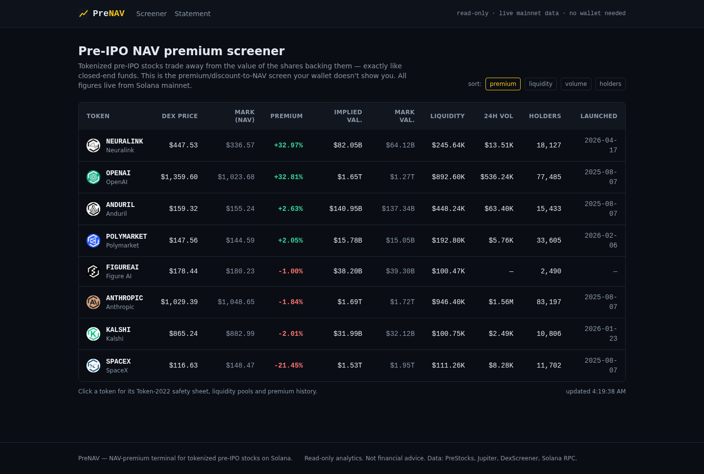
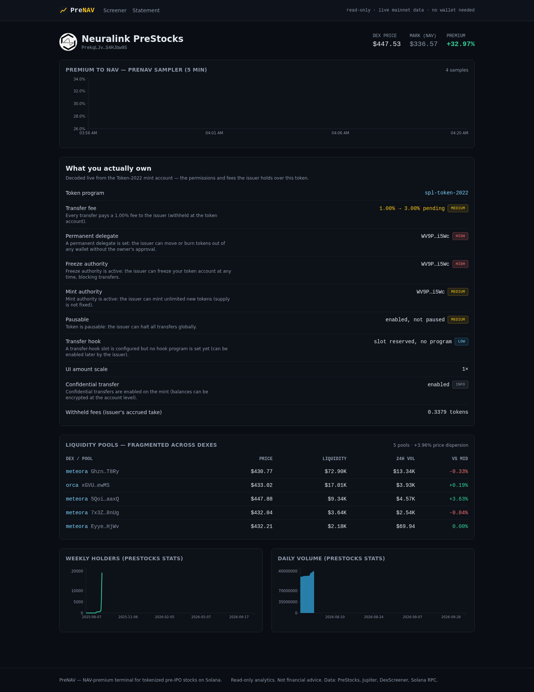
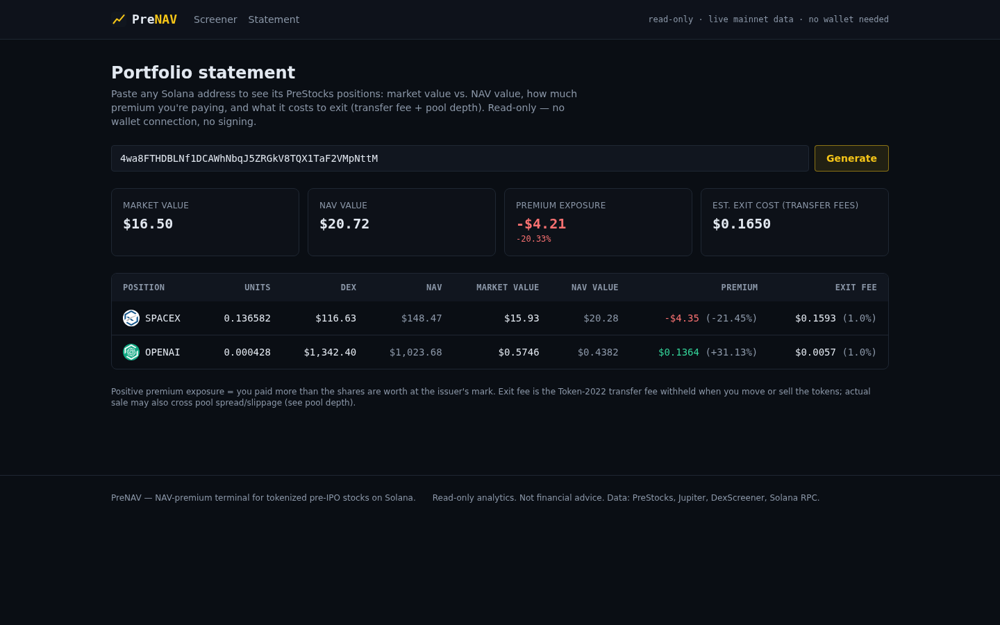

# PreNAV

**The NAV-premium terminal for tokenized pre-IPO stocks (PreStocks) on Solana.**

Closed-end funds have had discount/premium-to-NAV screens for decades. Tokenized
pre-IPO SPV tokens have the exact same structure — a token trading on DEXes vs.
the issuer's mark price of the shares backing it — and no product surfaces it.

PreNAV is read-only analytics for the ~250k wallets holding PreStocks
(ANTHROPIC, OPENAI, SPACEX, NEURALINK, ANDURIL, KALSHI, POLYMARKET, FIGUREAI):

- **Screener** — every PreStock's DEX price vs. NAV mark price, premium/discount,
  implied vs. mark valuation, liquidity, volume, holders.
- **Token page** — premium history (5-minute sampler), a live-decoded
  **Token-2022 safety sheet** (transfer fee, permanent delegate, freeze/mint
  authority, transfer hook, scaled-UI multiplier, confidential transfer,
  pausable), DEX pool fragmentation with price dispersion, plus holders/volume
  charts from PreStocks stats.
- **Portfolio statement** — paste a Solana address → PreStocks positions,
  market value vs. NAV value, premium exposure ($), exit-cost estimate
  (transfer fee + pool depth). Shareable `/portfolio/<address>` URLs.

The backend computes from live mainnet data; the hosted static demo may use a
bundled snapshot. No paid keys, wallet connection or transactions are needed.

## Live

- Frontend demo: https://dist-oxrjakkt.devinapps.com
- The hosted demo can use a bundled snapshot; deploy the backend for live API data.

## Screenshots

| Screener — every PreStock's DEX price vs. NAV | Token page — live Token-2022 safety sheet + pools | Portfolio statement — market vs. NAV per position |
|---|---|---|
|  |  |  |

## Architecture

```
prenav/
  backend/      FastAPI + httpx + APScheduler + SQLite
    app/sources/    prestocks.py · jupiter.py · dexscreener.py · solana_rpc.py · pyth.py (optional)
    app/sampler     every 5 min: mark + DEX price → premium_samples (SQLite)
    app/token2022.py  Token-2022 mint extension decoding → safety sheet
    tests/          pytest (respx-mocked unit tests + `pytest -m live` suite)
  frontend/     Vite + React 18 + TypeScript + Tailwind + Recharts + TanStack Query
```

Data sources (all keyless public APIs; PreStocks has no CORS so it is proxied
through the backend):

| Source | Endpoint | Used for |
|---|---|---|
| PreStocks | `prestocks.com/api/prestocks`, `/api/stats` | mark price, valuations, holders, volume, launch dates |
| Jupiter lite-api | `lite-api.jup.ag/price/v3`, `/tokens/v2` | DEX price, liquidity, 24h change |
| DexScreener | `api.dexscreener.com/latest/dex/tokens/<mint>` | pool list, per-pool price/liquidity/volume → dispersion |
| Solana RPC | `api.mainnet-beta.solana.com` | Token-2022 mint decoding, epoch, wallet token accounts |
| Pyth (optional) | `pyth.dourolabs.app/hermes` | 24/7 pre-IPO index for ANTHROPIC/OPENAI (`PYTH_API_KEY`) |

Resilience: mint decodes cached 10 min, prices 60 s, stats 5 min; 429/5xx
backoff; on upstream failure the last-good SQLite snapshot is served with an
`X-Data-Stale: true` header.

## Static mode (zero-backend deploy)

The frontend can build as a fully static site — no FastAPI backend required:

```bash
cd frontend && VITE_STATIC_MODE=1 npm run build   # dist/ is hostable anywhere
```

In static mode the browser reads a bundled snapshot
(`public/data/snapshot.json` — PreStocks list, stats, premium history) and
calls the keyless CORS-open sources directly (Jupiter, DexScreener, Solana
RPC) with multi-endpoint RPC failover. The Token-2022 safety sheet is decoded
client-side (same logic ported to TypeScript). Because public RPCs block
`getTokenAccountsByOwner` from browsers, the portfolio page derives each
mint's Associated Token Account with an in-bundle PDA derivation (pure
bigint ed25519 + WebCrypto SHA-256, no deps) and reads all eight in one
`getMultipleAccounts` call; non-ATA token accounts are not covered in static
mode (the backend covers them via `getTokenAccountsByOwner`).

To regenerate the snapshot with fresh premium history, run the backend sampler
for a while, then export `premium_samples` + the two PreStocks endpoints into
`frontend/public/data/snapshot.json` (schema: `{generatedAt, tokens, stats,
premium: {<SYM>: [{ts, mark, dex, premiumPct}]}}`).

## Run

```bash
# backend
cd backend && python3 -m venv .venv && .venv/bin/pip install -e ".[dev]"
.venv/bin/uvicorn app.main:app --port 8420   # http://localhost:8420/api/health

# frontend
cd frontend && npm install && npm run dev    # http://localhost:5173
```

Optional env: `SOLANA_RPC_URL` (e.g. Helius) for higher RPC limits,
`PYTH_API_KEY` for the Pyth index line, `PRENAV_DB_PATH` for the SQLite file.

## Tests

```bash
cd backend && ruff check app tests && ruff format --check app tests && pytest   # unit (mocked)
cd backend && pytest -m live                                                  # live upstreams
cd frontend && npm run typecheck && npm run build && npm run test:e2e           # Playwright
```

## Open-source components used

Python: FastAPI, uvicorn, httpx, APScheduler, SQLite. Dev: pytest, respx, ruff.
Frontend: React 18, Vite, TypeScript, Tailwind CSS, Recharts, TanStack Query,
react-router. Tests: Playwright.

## Disclosure

Built solo during the hackathon window with AI coding agents (Devin).
Read-only project: no swaps, no signing, no transactions. Not financial advice.

## Hackathon submission

**What it is:** PreNAV — a read-only NAV-premium terminal for the ~250k wallets
holding PreStocks (tokenized pre-IPO stocks on Solana). Closed-end funds have
had premium/discount-to-NAV screens for decades; pre-IPO SPV tokens have the
exact same structure and nobody surfaces it.

**Right now on PreNAV:** OPENAI trades ~+32% above its issuer's mark, SPACEX
~-20% below it, and every transfer pays a 1% Token-2022 fee to the issuer —
with a permanent delegate able to move your tokens. Holders couldn't see any
of this.

**On-chain:** all premium math, fees, delegate/authority flags, and portfolio
balances are decoded live from mainnet mints and DEX pools — keyless, no
wallet connect, nothing moves money.

**Tracks:** Main + PreStocks.

Built solo during the hackathon window with AI coding agents (Devin).
Open-source deps: FastAPI, httpx, APScheduler, React, Vite, Tailwind, Recharts,
TanStack Query, Playwright, pytest.
